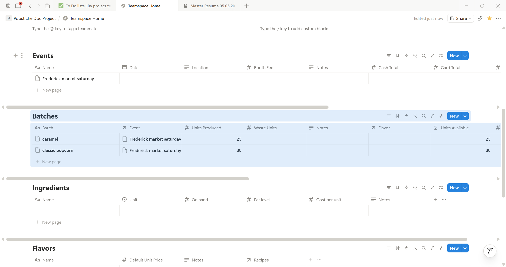

# Notion Implementation

## Why Notion
- Low operational overhead
- Mobile-friendly during events
- Flexible iteration

## Current Databases
- Events
- Batches
- Ingredients
- Flavors (placeholder)
- Recipes (placeholder)

 

## Known Constraints
- Limited relational reporting
- Formula complexity
- Manual reconciliation steps